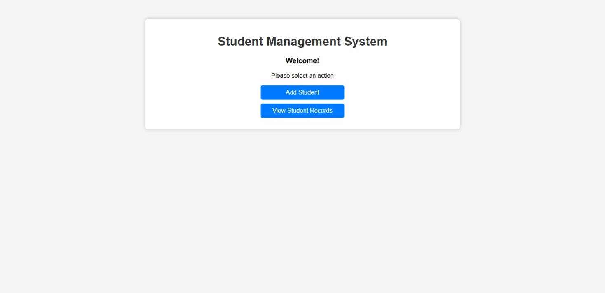
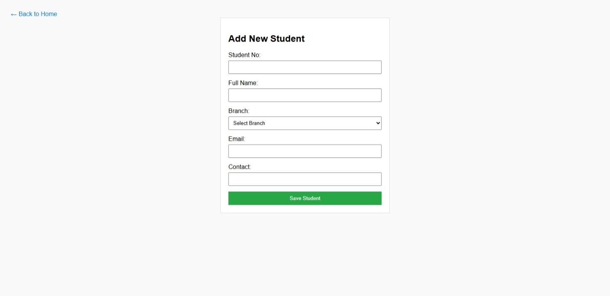
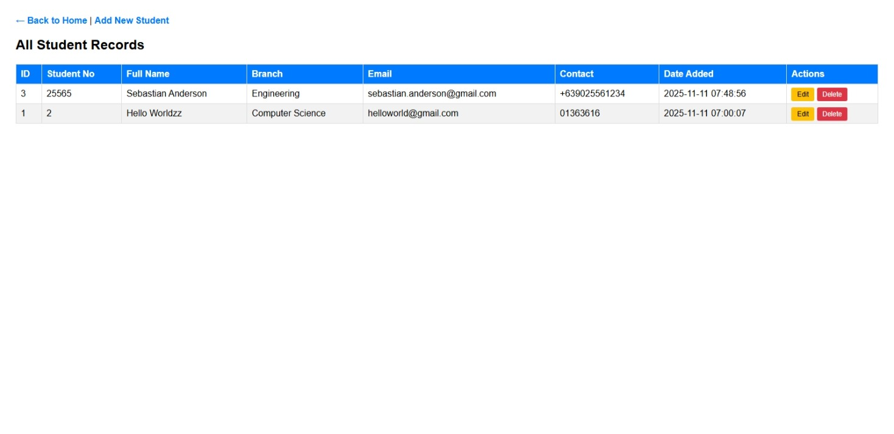
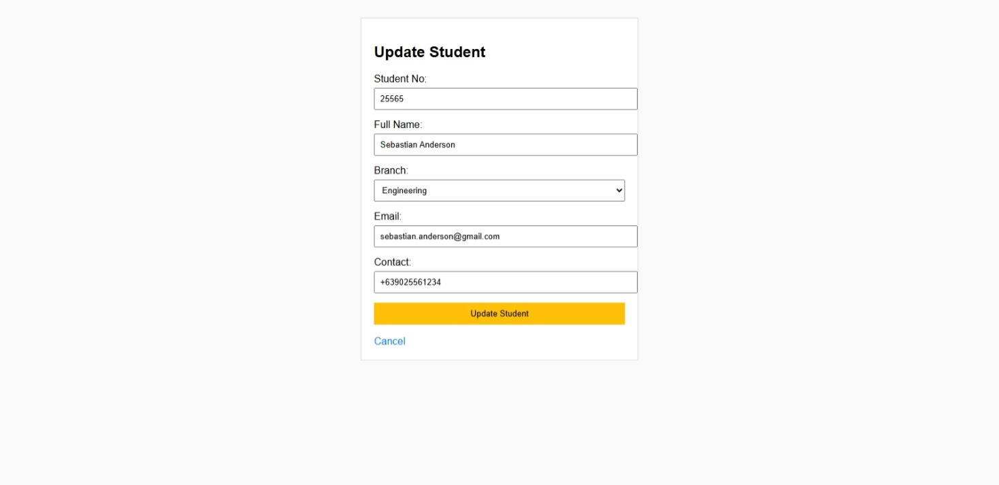
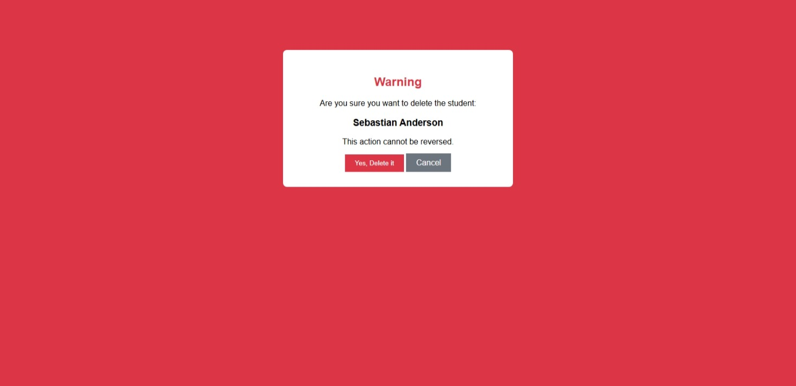

# Student Management CRUD System
This is a project for the midterm exams of the IT-301 subject. 

## ✨ Features
- Create student record
- Read student records
- Update student record
- Delete student records
- A homepage

## ⚙️ Technologies used
- PHP
- HTML
- CSS
- Xampp/phpMyAdmin

## 📸 Screenshots

